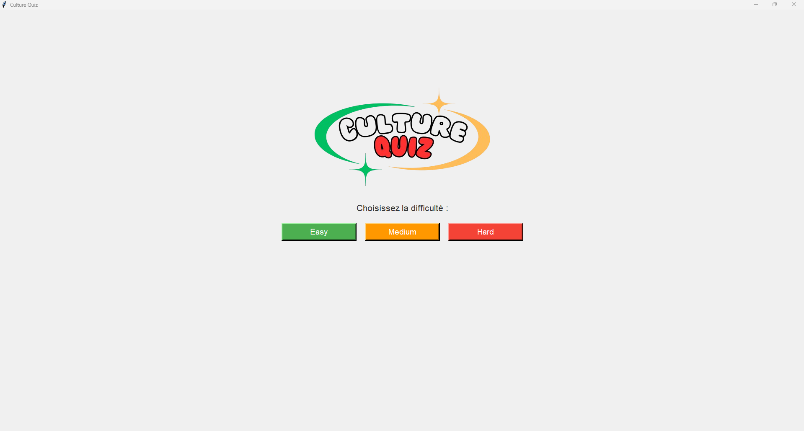
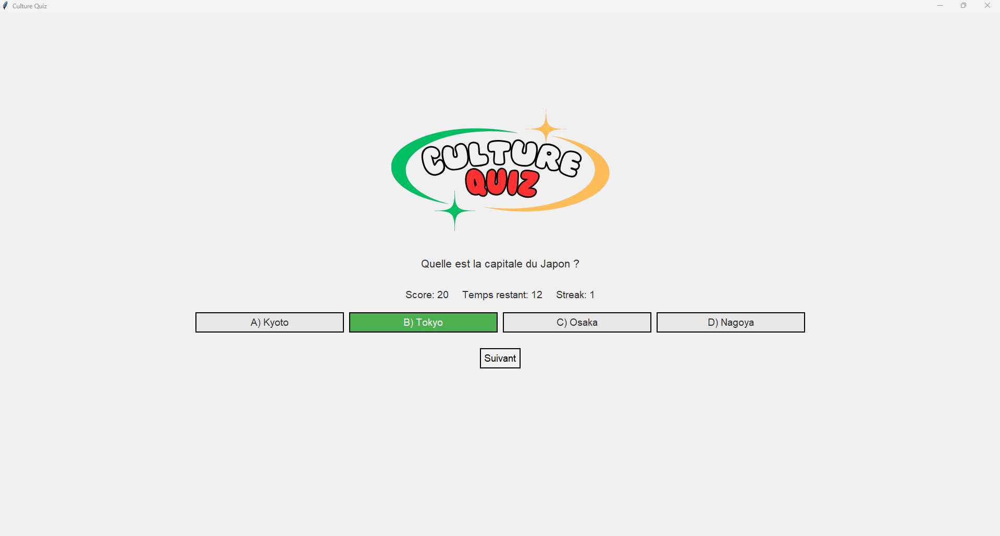

# Quiz_Game

## Description

Quiz game est un simple jeu QCM fait en python. 
Il est associé à une base de donnée stockée dans un fichier JSON
contenant des informations sur les joueurs et les questions. 

## Features

- système de scoring.
- GUI Interface 
- BONUS (gagner des points supplémentaires en fonction du temps pris pour répondre à une question)
- Système de leaderboard
- Chronomètre 
- Système de streak 

## Utilisation
### Ecran principal
Choix du niveau par l'utilisateur

### Quiz 
Le joueur répond à une serie de question en 
fonction du niveau de difficulté choisi

### Ecran final 
L'utilisateur entre son pseudo et a accès au leaderbord 
et se compare aux autres joueurs

